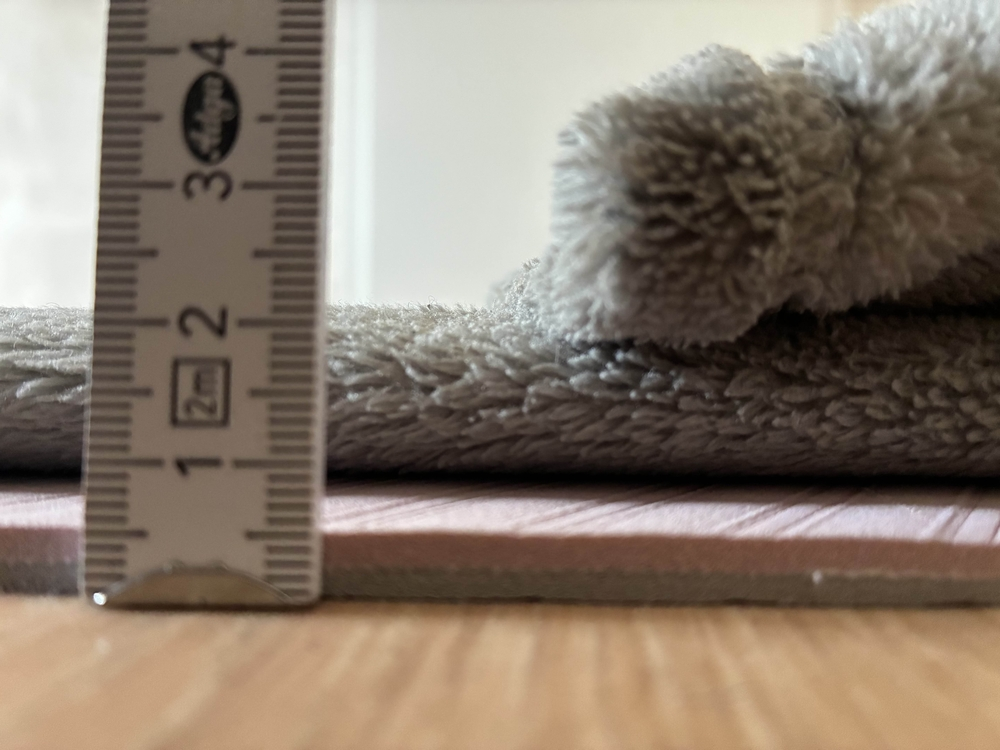

+++
title = "📚 Floor Sleeping Review 2"
date = 2025-10-10
description = "finally cracked the code"
+++

<figure>

<figcaption><i>
right side profile of my setup
</i></figcaption>
</figure>

I finally got it, I cracked the code.\
For the last nine nights I have slept on the floor and I have no intentions of going back.
Even my apple watch agrees that the sleep I now get is as restful as on my bed.

The last time I seriously tried this three years ago I used a 6mm yoga mat and a sleeping bag.
Now I am layering [this](https://www.ikea.com/de/de/p/trattviva-tagesdecke-dunkelgrau-60615067/) 230x250cm blanket from IKEA, folded twice on the long side, on top of the yoga mat.
Since the short side is still a bit longer than the mat, I let it overhang slightly and fold in the head side for some extra elevation.
During the day I let both the blanket and yoga mat air out.
As for sleeping positions, this works well on my back and on either side.

Finally I can rid myself of my most annoying possession, my bed.\
This is a sequel to [my second lifestyle post](https://port19.xyz/lifestyle/floor-sleeping-review/) from 3 years ago.