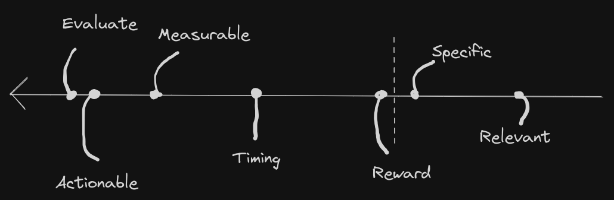

+++
title = "📚 Goal Setting"
date = 2023-10-20
description = "My Method and Heuristics"
+++

Setting goals is one of the best ways to ensure you stay on track and keep improving yourself. \
In this post I want to reveal my method of goal setting and it's supporting heuristics.

## SMART (-er)

Just to get this out of the way: yes, I am familiar with the SMART acronym and employ it's heuristics:
- Specific, Measurable, Actionable, Relevant, Timed, *Evaluate, Reward*\

<figure>

<figcaption><i>
My ranking of the basic heuristics based on importance
</i></figcaption>
</figure>

Of these heuristics I find Measurability, Actionability, Timing and Evaluation significantly more important than Specificity, Relevancy or Reward.
I won't waste time assessing relevancy in depth, and also don't need my goals to be more specific than what is necessary to fulfill the other heuristics of measurability and actionability.
As a reward, since I fortunately already have everything I want, I usually go for a nice meal downtown.

## Frequency and Dismissal

Goals come in various shapes and sizes and deserve different treatment because of it. \
I don't set new long-term/yearly goals more than once a quarter at most, and when I do, I set one at a time.

More short term goals, quarterly or monthly goals, usually come in groups of up to ten. \
A couple of weeks into a quarter, or days into the month I reevaluate, discarding around half of them. \
This can be seen with the [Q4 goals](https://port19.xyz/tech/status-update-2309/) I shared recently.
I started setting up syncplay and jitsi, but then discarded those goals due to a change in perspective regarding their value proposition and operational difficulty.
Sometimes it's new information that makes a goal obsolete, such as with my arch-mirror and netcup migration goals.

As a rule of thumb I set many short-term goals, but dismiss most of them quickly. \
I prefer trying out several short-term goals to over-analyzing them in advance.

## Don't talk about it

For long-term goals: don't tell anyone. \
Not telling anyone drastically increases your chances of sticking to and achieving your goal. \

## Fun goals

One more thing I occasionally do that may appear strange is to set, for lack of a better term, fun goals. \
Like this month I set and achieved the goal to watch at least two anime series. \
I treat fun goals as no less important than regular productivity goals. \
This greatly helps to balance out any toxic perfectionism.

## Start small

My system has matured to be this elaborate over years. \
Goal setting takes practice and doesn't need to be a consistent practice to yield results. \
I don't set new goals every month if I don't feel like it. \

Chances are you set a goal for this year. Are you on track? \
If you are not, is there a smaller sub-goal that you can still achieve this year?
