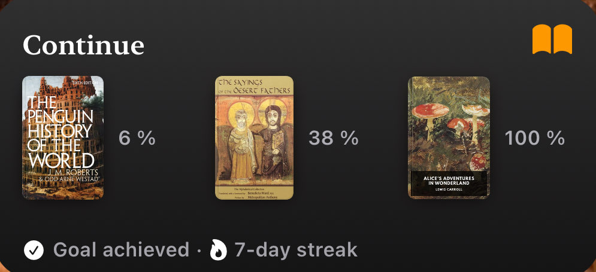

+++
title = "📚 What I've read this year"
date = 2025-11-30
description = "shoutout to standardebooks.org"
+++


<details>
<summary>
plaintext list for copy-pasting
</summary>

```md
# Fiction
  - George Orwell - Animal Farm
  - Leo Tolstoy - The Kreutzer Sonata
  - Franz Kafka - Metamorphosis
  - F. Scott Fitzgerald - The Great Gatsby

# Politics
  - Arthur Schopenhauer - On Women
  - Lewis Carroll - Alice's Adventures in Wonderland
  - Niccolò Machiavelli - The Prince
  - Karl Marx - The Communist Manifesto

# Theology
  - The Holy Spirit - The New Testament
  - St. Alphonsus Liguori - 12 Steps to Holiness and Salvation
  - St. Louis de Montfort - The Secret of the Rosary
  - St. Benedict of Nursia - The Rule of Saint Benedict
```
</details>

<br>

This year was the first year in a long time that I took reading seriously.
In the first half of the year this started as a religiously motivated reading of the new testament, one chapter a day at first.
As spring turned into summer and I grew in my faith, I started reading "12 Steps To Holiness And Salvation", which I read a chapter every 2-3 weeks, and plan to re-read next year 1 chapter a month, as intended by the redemptorist order.

In summer, I expanded my reading to "The New Penguin History Of The World", which I may finish next year and fiction with Kafka's Metamorphosis. One thing that helped with retaining what I read in "The New Penguing History Of The World" better was to first listen to the [audiobook version](https://www.youtube.com/playlist?list=PLNlh4Gp_Ev_an3LoU7kipa1eHdyQa3Syx) of a chapter before reading it the next day.

The move to reading ebooks with apple books had the biggest impact on my reading by far. Something about the 30 minute daily reading goal and streaks is just really motivating to me, especially on days where I'm not super motivated to read.
Having my books on my phone also enables me to read in short bursts when commuting or standing in line somewhere.
It was in ebook form that I read the majority of the books on display.
Also just look at how pretty the widget looks:



Next year I'd like to match my 12 books this year, but perhaps read books that are a bit longer, as this year the only book that definitely surpasses 100k words is the New Testament.

At this point I want to shoutout [standardebooks.org](https://standardebooks.org), which is the best place to get perfect quality public domain ebooks.
Go and read at least a short book this advent.
