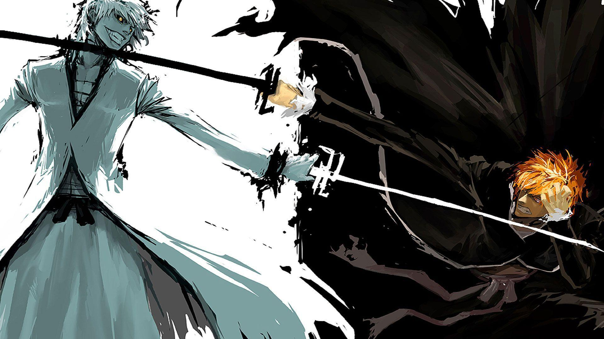

+++
title = "📚 Facing your shadow"
date = 2024-08-12
description = "Christianity reference?"
+++

One thing the self-help gurus don't tell you is that there exist dark parts of you that you cannot change.
You have a great deal of influence over your habits, mindset, behaviour.
But falling for the illusion that your self is fully mutable and can be mended into perfection is dangerous.

In the christian canon we're all born as sinners and can only be forgiven by god.
Yes, there are the [seven deadly sins](https://en.wikipedia.org/wiki/Seven_deadly_sins) and [heavenly virtues](https://en.wikipedia.org/wiki/Seven_virtues) which are good guiding stars, but even there you will inevitably slip up.
This is still applicable if you're an agnostic, hindu, a reddit atheist, or believe in the [spaghetti monster](https://www.spaghettimonster.org/).
Throughout your life you'll continue to fall short of conformance to your high code of ethics.

The initial response is one to change, and for many smaller imperfections this can work wonders.
But there comes a point where resisting one minor sin inhibits your capacity to display a major virtue.
Shame and self-hatred are just as self destructive as uninhibited indulgence in your sin/immorality.

For the sins you can't shake forgive yourself and be kind.
If you're religious, ask the lord for his forgiveness.
And then focus on the virtues you're capable of.