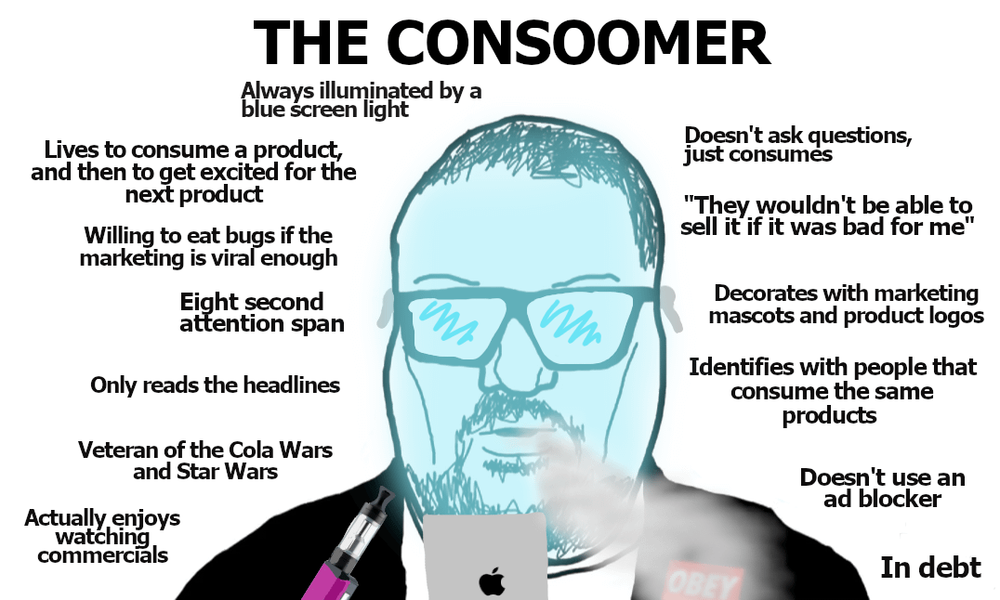

+++
title = "📚 Unyielding Consumerism"
date = 2024-05-07
description = "~1 year update on spending"
+++

# *~1 year update on my spending habits*

<figure>

<figcaption><i>
Okay, it was never that bad
</i></figcaption>
</figure>

## Where we left off

So in July of last year, following a particularly egregious impulse purchase, I started to curb my spending by following a new system.
I call it the [rolling shopping list](https://port19.xyz/lifestyle/rolling-shoppinglist/), and have been using it as a tool to stop impulse purchases with great effect. Yet, it hasn't been the silver bullet to solve all spending issues that I had wished it to be.

## Needless shopping

While I've been largely consistent in my avoidance of impulse purchases, with only one or two minor slip-ups since, not all my purchases are as great as I'd like them to be.
The reason for this can't be impulse, that variable is accounted for, but rather a discrepancy between perceived wants and actual wants.
I congratulate the advertising industry for successfully playing it's part in this.

Whereas with the impulse purchases of before I would receive the item and go *"what was I thinking!"*, the new needless orders have me wondering how I came to my inflated expectations that are now disappointed.

To illustrate, I bought a used PlayStation 3 slim recently for 89€ and while I don't flat out regret the purchase, it now sits on a shelf waiting to be used some day. More extreme would be my order of a shaker from GamerSupps, which I used once before recently throwing it away in realisation that I don't even like protein shakes or energy drinks.

## Ripoff Restaurants

Another annoyance I deal with is the inflation in german restaurants and their decline in quality.
I can easily justify the occasional restaurant visit with friends as a social event, but can't help but feel a little ashamed for wasting 2-4 bucks for a coffee every other day.
Or 8€ for a mediocre döner kebab.

I'd say with my cooking skills getting better and better, as you might infer from my recently published stew recipes, it should be manageable.
It's nowhere near as bad as ~18 months ago where I set my personal record with 450€ in food expenses in a single month.

Perhaps it's less about the monetary cost of the food and more about the perceived gap between the price and the quality. Should I do meal prep? Idk, I'll figure something out.

## Conclusion

While I'm happy to have reduced my needless shopping over the past year, heck I even managed to avoid spending a thousand bucks on an [M1 Mac](https://port19.xyz/tech/macos/), I still have the unyielding urge to - occasionally - consoom product.
Oh well...
