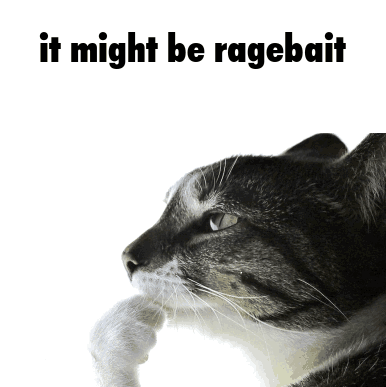

+++
title = "📚 On (Rage)Bait, The News and Reddit"
date = 2025-06-03
description = "It's not about time"
+++

So almost 3 years ago I wrote a post about [social media](https://port19.xyz/lifestyle/avoid-social-media/) and how it wastes your time.
I kind of cringe at this cheap proclamation of virtue that any critique of social media is.
We all know that we should spend less time on our devices to a point that its fallback content for uninspired youtubers to yap about how bad TikTok is.
In that post I focused on one aspect of what makes social media disadvantageous to engage in: time cost / opportunity cost.

I have now changed my perspective on the matter and am gonna go ahead and say that **consuming brainrot on TikTok or video essays on Youtube is infinitely better and more virtuous than watching the news or scrolling reddit.**
To scroll mindlessly is vacuous and can cost a great deal of time, I'm not denying that, but it does not by its nature poison your very soul.

I'm putting reddit and the news on the same tier of degeneracy because both have an extreme negativity bias.
War here, economic turmoil there, with some orange man tweets sprinkled in as well.
Culture war, man against woman, right against left, up against down, while our kids can't even read a book front to back.
The news at least has a professional touch to it and tries to convince you it has objective or nuanced takes, on reddit the hivemind is so bad that on the political posts, which make up half of the frontpage, you usually see a chorus of identical opinions, half of which probably being bots, and a couple "removed by moderator"s, remnants of opposition.
X formerly Twitter TM is not better either. Its the same deal just right wing instead of left wing and with perhaps slightly less obnoxious censorship.

However if I unplug and spend a day offline I realise how quiet my neighbors are, I appreciate the full fridge and freezer I have, enjoy a short walk in the forrest.
I don't care about the bombs exploding in far-off lands or the apparent oppression of the minority of the day. Even cleaning the bathroom is kind of fun in that mood of blissful indifference.

This is a rant more than it is advice. I fall for ragebait every day. I still watch the news every once in a while. But yeah, if you're scrolling reddit or X thinking you're somehow superior to gen alpha ipad kids doing TikTok dances, think again zoomer. You're the grumpy old guy now.
