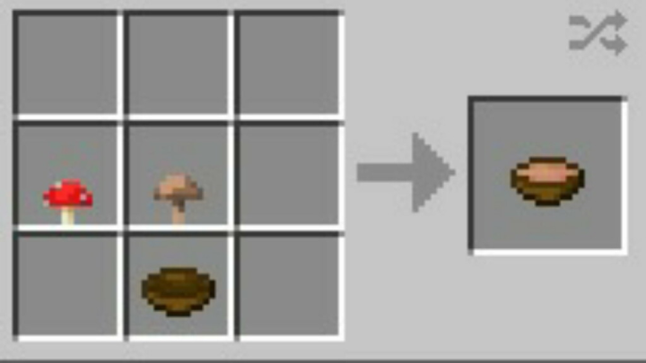

+++
title = "🍚 Mushroom Stew"
date = 2024-04-25
description = "Minecraft irl ?!"
draft = true
+++

- Prep time: 10 min
- Cooking time: 10 min

## Ingredients

- 250g champignon
- 50-100g other mushrooms *(opt)*
- 30g dried porcini *(sub: other expensive mushrooms)*
- 40g butter
- 2 onions
- 200g cream
- 500ml water
- 3 tsp broth powder
- 1 tsp curry powder
- 1 sp flour *(opt)*
- some parsley *(opt)*
- black pepper *(opt)*
- 1 baguette *(opt)*

## Tools

- cutting board
- cutting knife
- small pot
- cooking spoon

## Directions

- Clean the onions (with a kitchen cloth/paper towel, no water)
- Cut all the mushrooms
- Cut the onions
- Put the butter in the pot on high heat
- Once the butter has melted, add the mushrooms, onions and optional flour
- Roast for 5 minutes
- Add curry powder and mix
- Roast for another minute
- Add borth powder, water and pepper
- Bring to a boil
- Stir occasionally
- Turn heat to medium and add the cream
- Simmer for another 3 minutes
- Optionally garnish with parsley
- Works well with baguette as a side
- Done. Serves 2 *(add more pepper when serving)*
