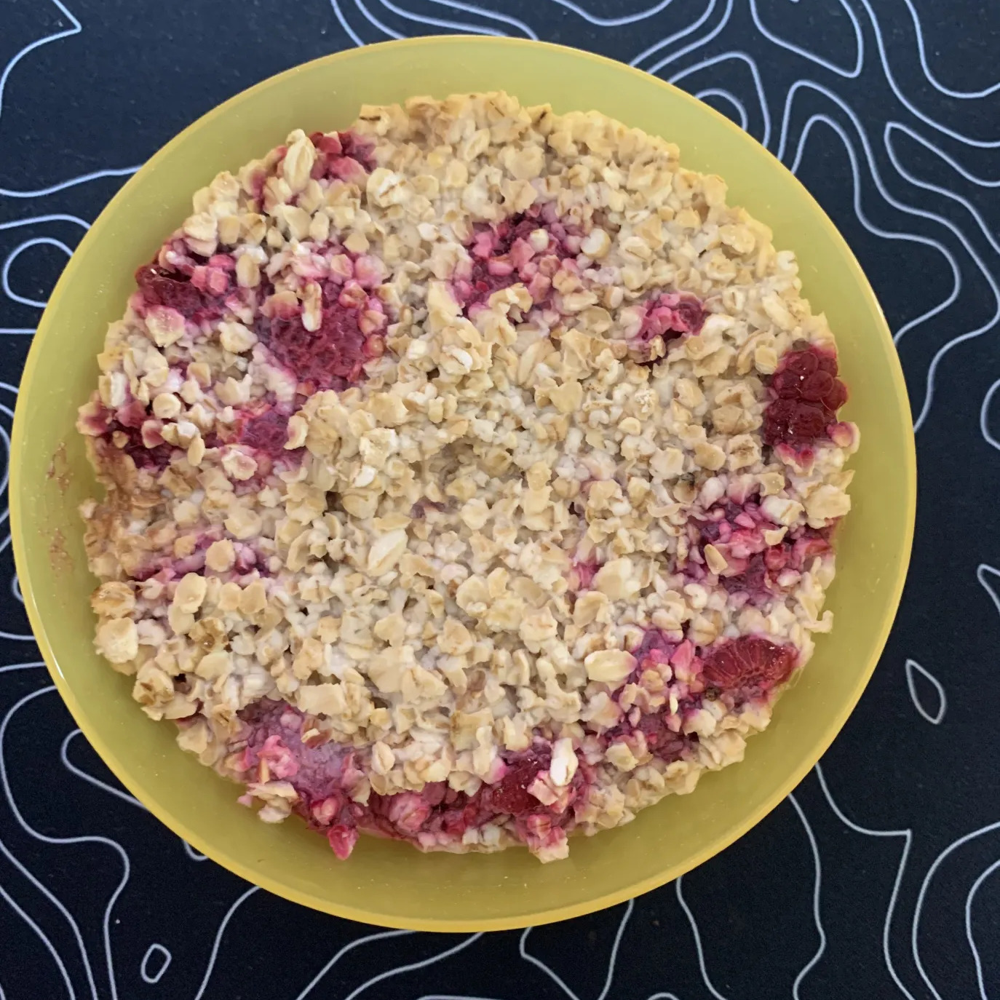

+++
title = "🍚 Overnight Oats 2.0"
date = 2025-06-24
description = "Patched Overnight Oats Recipe"
+++

[V 1.0](https://port19.xyz/recipes/overnight-oats)

- Prep time: 5 min
- Fridge time: 6-12 hours

## Ingredients

- 150g Oatmeal
- 70g raspberries
- 300g of milk
- (optional) 10g flavored protein powder

## Tools

- bowl
- plate
- spoon
- teaspoon
- measuring cup

## Directions

- measure your oatmeal and add half of it to your bowl
- now add the protein powder and mix
- now add some raspberries, lightly mix again
- add the remaining oatmeal
- add the milk and stab it with your spoon a few times
- cover the bowl with a plate
- put the covered bowl into your fridge
- go to sleep
- Enjoy with a healthy breakfast
