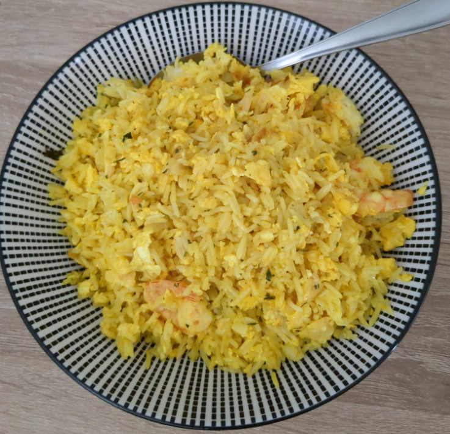

+++
title = "🍚 Shrimp rice"
date = 2023-10-14
description = "The most yellow meal in the world?"
+++

- Prep time: 5 min
- Cook time: 25 min

## Ingredients

- 100g (frozen) shrimp
- 2 eggs
- 150g basmati rice
- 1 small white onion
- 2 cloves of garlic
- ~50ml Rapeseed oil *(sub: sunflower oil)*
- 1 sp turmeric *(sub: curry powder)*
- 1 tsp white pepper
- 1 tsp sesame seeds *(opt)*
- some green garnish *(opt)*

## Tools

- rice cooker *(buy one, it's worth it)*
- pan
- cooking spoon
- cutting board
- knife

## Directions

- Put rice into rice cooker
- Heat oil in the pan
- Chop the garlic
- Chop the onion
- Put garlic and onion into the pan
- Add white pepper
- Leave for 2 minutes on high heat
- Add eggs
- Leave for another 3 minutes, stir occasionally
- Add shrimp
- Leave 5 min
- Flip the shrimp
- Leave another 5 minutes
- Add rice, turmeric and sesame seeds
- Stir well until the rice is all yellow
- Leave on low heat for 2-5 minutes
- Optionally garnish with some green herbs
- Done. Serves 2
