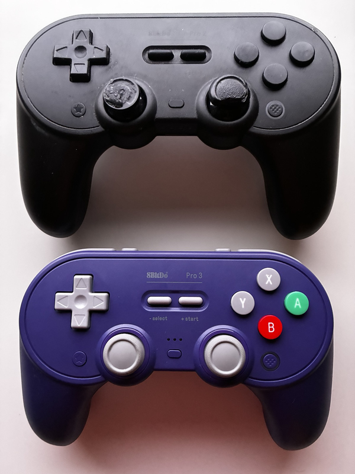
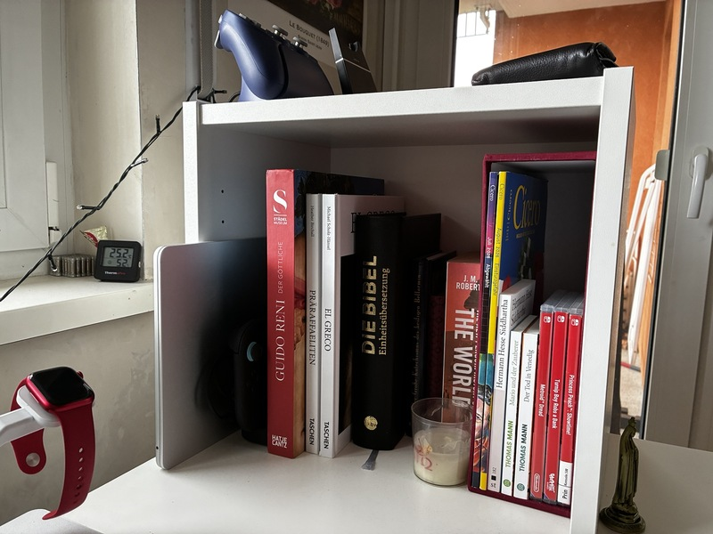

+++
title = "💻 8bitdo pro 3 controller review"
date = 2026-08-22
description = "as a 5 year 8bitdo pro 2 user"
+++

<figure>

<figcaption><i>
The 8bitdo pro 2 (top) has suffered some wear and tear
</i></figcaption>
</figure>

<audio controls>
  <source src="narrated.mp3" type="audio/mpeg">
Your browser does not support the audio element.
</audio>

After putting it off for months now, I finally got around to ordering a
[new controller](https://geizhals.eu/8bitdo-pro-3-gamepad-violett-pc-mac-switch-2-switch-steamos-android-ios-ret00856-a3584613.html)
as my
[old one](https://geizhals.eu/8bitdo-pro-2-gamepad-black-edition-pc-mac-switch-android-ios-ret00409-a3310516.html)
has started to really show its age.
It's the direct successor to my previous one and has some key improvements that, had I known them earlier, would've made me buy one sooner.

## Convenience

After coming home from work, the first thing I often do is turning on my Nintendo Switch 2 to play a round or two of Fortnite,
which I've started to play around a month ago, and enjoy greatly.
This controller improves two points of friction with this.
I no longer have to worry if it is sufficiently charged, because it now rests on its charging dock.
And I no longer have to reach into my desk shelf to turn on my Switch 2 because this one supports [shake to wake](https://youtu.be/kLT-fUVxsBU?t=135).

<figure>

<figcaption><i>
My Desk Shelf
</i></figcaption>
</figure>

## Gameplay

There are toggles to change between linear L2 triggers with travel, and non-linear clicky L2 triggers without,
which makes a difference when you have to quickly shoot an enemy ambushing you from around a corner.

In addition, besides the paddles already present on the 8bitdo pro 2, this one has L4 triggers. \
Not sure if I'll ever use those.

## Repairability

In terms of repairability, this controller takes one step back and two steps forward.
The joystick caps are replaceable, and as you can see from the 8bitdo pro 2, they are the first component to degrade for me.
The face buttons are also replaceable.
But the battery no longer is, which, given the charging dock, is already a mitigated problem.

## Conclusion

I really like this controller and can wholeheartedly recommend it to anyone looking for a third-party Switch or Switch 2 controller with symmetrical joysticks.
If you are after asymmetrical joysticks, the
[8bitdo ultimate 2](https://geizhals.eu/8bitdo-ultimate-2-bluetooth-controller-wuchang-pc-switch-2-switch-ret00851-a3582833.html)
is a very similar controller that will suit your needs.
