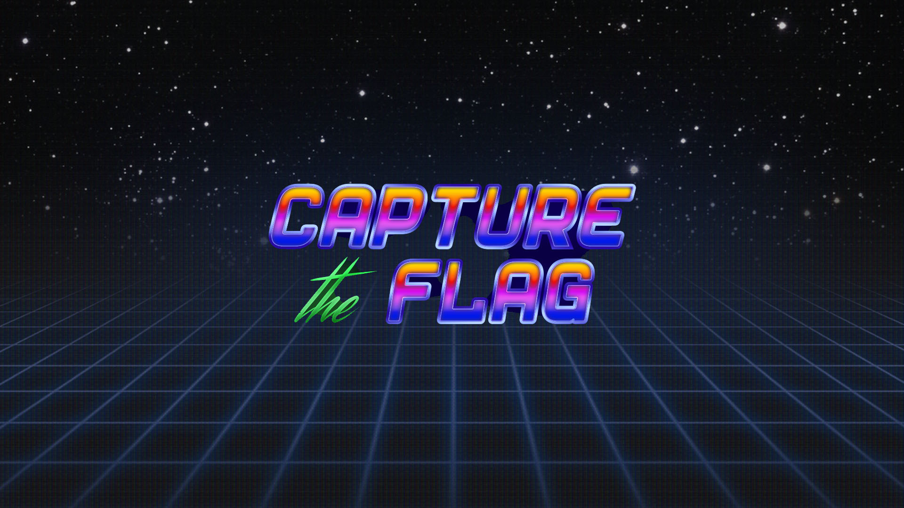
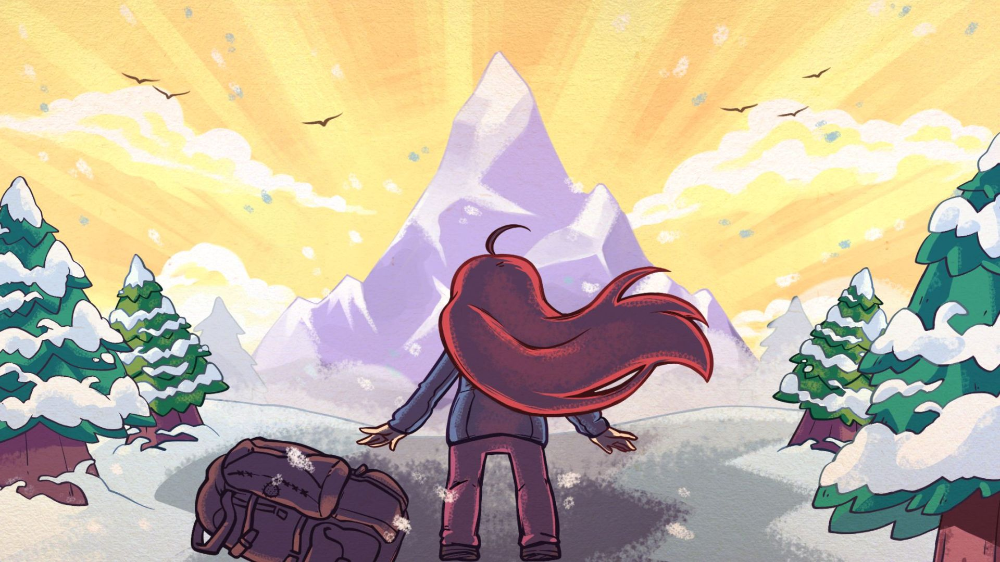
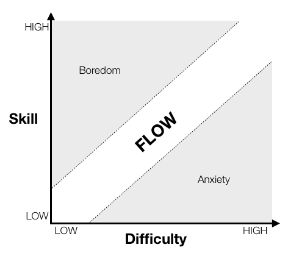

+++
title = "💻 CTF: My Origins"
date = 2024-04-29
description = "Where it all began"
+++

<figure>

<figcaption><i>
Google CTF 2018
</i></figcaption>
</figure>

## What are CTFs

Security CTFs, with CTF standing for Capture The Flag, are challenging, time bound IT security contests.
Jeopardy style CTFs are more common and feature a wide selection of challenges in a few different categories.
The main 5 categories are `crypto` (cryptography), `pwn` (binary exploitation), `rev` (reverse engineering), `web` and `misc`.
Occasionally you'll see stuff like `forensics`, `stegano` and `osint` pop up as well.
These contests usually last 48 or 72 hours over a weekend and can be competed in as teams or alone.

Outside of regular competition hours, there are long standing websites where you can improve your skills in a specific category.
These sites often host coherent paths that are called wargames, or may just have a loose collection of challenges. \
[Bandit](https://overthewire.org/wargames/bandit/) on OverTheWire is often recommended for beginners and will leave you a very competent linux user.
[cryptohack.org](https://cryptohack.org/) and ~crackmes.one~ [challenges.re](https://challenges.re/) are also notoriously good for the `crypto` and `rev` categories in particular.

For more on CTFs I recommend you watch [this](https://www.youtube.com/watch?v=8ev9ZX9J45A) youtube video after you finish my post.

## The 4to3 Era

While I participated in my first CTF in the summer of 2018 - the [Google CTF](https://ctftime.org/event/623) - which prompted me to learn python, I ended up forming the [4to3](https://ctftime.org/team/88176) team for more CTFs in late 2019.
I consider the founding members to be SidSploit, SadKris, temeZer, flyfly and me, going by the alias of ura back then. The 43 in my ura43 alias before the port19 rebrand was an homage to them.

We were pretty good, finishing middle of the pack most of the time, with an affinity for shorter CTFs.
In addition to being the team captain, signing us up for events and stuff, I focused on the `crypto` category with some occasional `misc` stuff.
In 2021, after a good run of roughly two years and our joint interest in CTFs and cybersecurity slowly fading, we disbanded the team, with SadKris being the only member to remain focused on a career in the field of cybersecurity, tho I've lost touch with him since.

## The Mountain

CTFs have taught me the sheer mountain of competence you can ascend as a hacker[¹](https://web.archive.org/web/20240824161944/https://www.catb.org/~esr/faqs/hacker-howto.html#what_is).
Every cracked flag is a massive achievement with many hours of work behind it.
And even in events with no flags I did not leave feeling disheartened, rather inspired by a newfound gap in my knowledge and skills.
It has taught me that the journey doesn't have to end after you learn basic programming and that there is a whole other league of experts that will welcome you in their ranks if you put in the *years* required to get there.

<figure>

<figcaption><i>
how I felt embarking on CTFs
</i></figcaption>
</figure>

## Impostor Syndrome Resistance

You may know this diagram showing the optimal zone to enter the flow state.
The concept of a flow state itself isn't particularly important for this, but notice the label of the lower right quadrant: *Anxiety*.
This is the quadrant you'll find yourself in during a CTF when it comes to the challenges presented.
And this doesn't just apply to DefCon.
For mere mortals like me ~back then~, even regular CTFs present some of the hardest challenges available.

Persevering through these challenges and netting the occasional flag has made me extremely impostor syndrome resistant.
I know that the vast majority of programmers at least sometimes have the opportunity, the temptation, or perhaps the misfortune, to face the perceived impossible.
Some will interpret their hardship and failure as evidence of their incompetence, their poor fitness for the field of IT. I don't.

It has been a few years since I participated in a CTF, but there is no doubt in my mind that they continue to show their influence on me.
Without my exposure to CTFs, I may not have persevered through the hardships along the way, and I wouldn't have been inspired to rise to the occasion every time an opportunity for growth presented itself.

And thus, the grind goes on.
