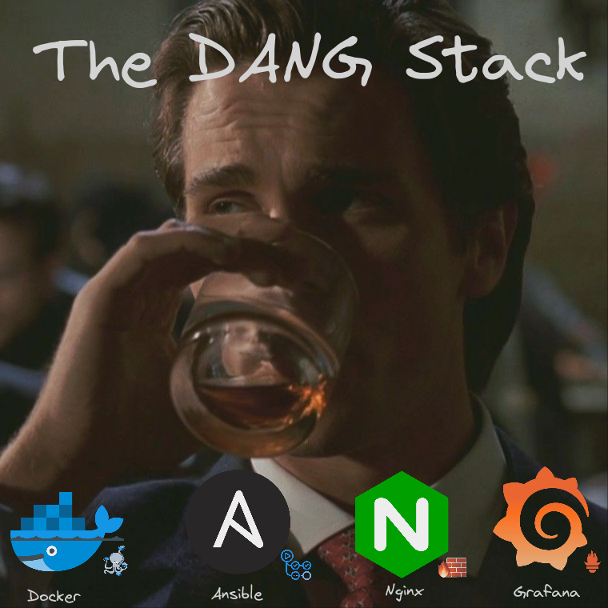

+++
title = "💻 Infrastructure with the DANG Stack"
date = 2023-07-10
description = "Docker Ansible Nginx Grafana"
+++

In this post I'll introduce the tech stack I use to build my personal infrastructure.
It is ideal for monolithic deployments, but will scale well to about a dozen servers.
The four main components are each supported by one or two smaller components to coherently achieve some administration task.

## Docker

[Docker](https://www.docker.com/why-docker/) is the most common containerization software in use today.
Its role in the DANG stack is to be the application runtime.
Docker allows a developer to build their application in a reproducible and deployable manner.
Stateless applications are benefited the most, but stateful applications work as well.

[Docker Compose](https://github.com/docker/compose#quick-start) is a way to connect the container to it's environment.
It connects ports, binds storage volumes and defines what containers are deployed in the first place.
This makes multi-container setups reproducible and easy.

[Docker Swarm](https://docs.docker.com/engine/swarm/) is a way to coordinate docker containers across several hosts.
You can think of it as a poor mans kubernetes, but since it is a lot simpler it's the superior choice for deployments up to a dozen servers.
I currently have no use for this, but might leverage it once I deploy to multiple servers.

## Ansible

[Ansible](https://docs.ansible.com/ansible/latest/getting_started/index.html) is the default Infrastructure as Code solution in use today.
It's job in the DANG stack is the provisioning and configuration of cloud resources.
It fits particularly well, as it has rich templating support and uses a push based config management, enabling use in a CI/CD context.

My current setup uses [Digital Ocean](https://m.do.co/c/e3fad703cc9b) for hosting, which is natively supported by Ansible.
This provisioning and deprovisioning saves me money during this experimental phase where I have no services to run 24/7.

[Terraform](https://www.terraform.io/use-cases/multi-cloud-deployment) is focused solely on cloud provisioning and as such supports many more clouds than Ansible does.
`terraform destroy` is also a more ergonomic way to deprovision resources when they are no longer needed, compared to having a `destroy.yml` playbook in ansible.
I will start using it once I leverage more involved cloud offerings or start to use more than one provider at once.

[Github Actions](https://docs.github.com/en/actions) can automate deployment in a CI/CD fashion. You can get creative here.
Perhaps deploy to a test environment when not on the master branch?
Maybe have automatic deprovisioning and provisioning with roll-over at regular intervals?
Cool stuff!
In any case you'll need to add an ssh key and an api token to Github secrets.

## Nginx

[Nginx](https://nginx.org/en/docs/) handles all the traffic.
It serves the DANG stack as a [reverse proxy](https://youtu.be/lZVAI3PqgHc) first and foremost, but also provides usage statistics in the form of access logs that are visualized on a Grafana dashboard.
Once you scale up, it also supports caching and load balancing, so that's nice.

Nginx is aided by any decent firewall, assuring visitors don't just sidestep your reverse proxy.
For this I personally use [ufw](https://en.wikipedia.org/wiki/Uncomplicated_Firewall), the uncomplicated firewall, which is a wrapper around iptables.

## Grafana

[Grafana](https://grafana.com/grafana) is the best visualization software for infrastructure monitoring out today.
It visualizes metrics that are aggregated by [Prometheus](https://prometheus.io/docs/instrumenting/exporters/), which itself needs a few exporters to give us the insights we deserve.

This component is the most open ended, as you can easily expand to Log Aggregation (e.g. via [Grafana Loki](https://grafana.com/products/cloud/logs/?plcmt=footer)) or even use all four Grafana products at once.
Prometheus is also not a set and forget solution, as you need to configure several exporters to gain insights beyond resource consumption.

## The Synergy

These four components lay a powerful foundation for an infrastructure that can grow to at least a moderate size.
Each component excels at it's job while not impeding any of the other components.
Check out [my repo](https://github.com/port19x/rapture) for a demonstration of what is possible and to follow where I'm going with this.
If you have any suggestions of software that might be fun for me to self-host, please let me know.
I'll also be publishing more focussed tutorials on how to achieve specific things with the components mentioned, as related resources can be dry sometimes.
