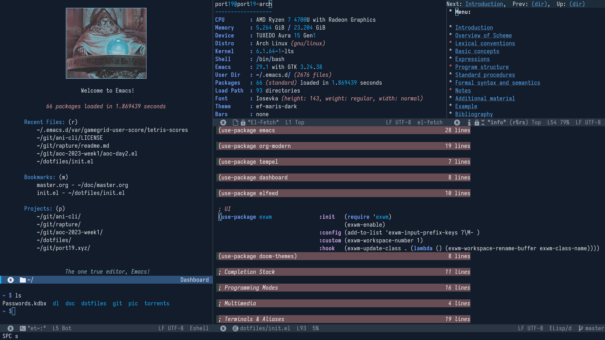

+++
title = "💻 Emacs X Window Manager Review"
date = 2023-12-03
description = "Refreshingly boring"
+++

<figure>

<figcaption><i>
EXWM - ef-maris-dark theme
</i></figcaption>
</figure>

So one week ago I decided to scrap my [awesomewm](https://github.com/awesomeWM/awesome) config in favor of [EXWM](https://github.com/ch11ng/exwm).
This has resulted in an noticeably more unified and fluent computing environment.
Now I can use my emacs bindings to launch and manipulate X windows!
One necessary workaround to make all my keybindings work in X windows was to add the `global-prefix` of [general.el](https://github.com/noctuid/general.el) to the `exwm-input-prefix-keys`[¹](https://github.com/port19x/dotfiles/blob/0484857d344c00c9a15bbc9ee55664e55bdda278/init.el#L90)

One thing I don't like is how EXWM handles workspaces, as buffers are not shared between them. \
Because of this I currently only use one workspace, but I may look into [perspective.el](https://github.com/nex3/perspective-el) to replicate workspace functionality with shared buffers

One problem I didn't encounter nearly as much as expected was emacs locking up. \
With emacs being single threaded, some EXWM reviews mention that you frequently have to spam escape or C-g to kill some blocking task.
This has only happened to me once when viewing a ~20000x10000 pixel jpeg and once when I spawned mpv from dired synchronously via `!` instead of asynchronously via `&`

EXWM, once set up, comes with zero learning curve for anyone already accustomed to emacs. \
Since I do most of my computing in emacs anyway, the move to EXWM was a natural next step. \
The only scenario in which I could see myself switching back to a separate window manager would be if multi-monitor support[²](https://github.com/ch11ng/exwm/wiki#randr-multi-screen) turns out to be poor when I'll need it again in January
