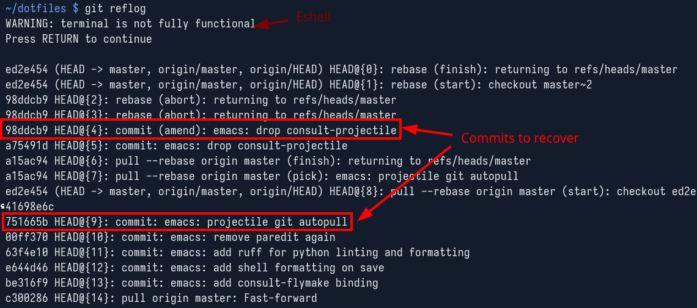
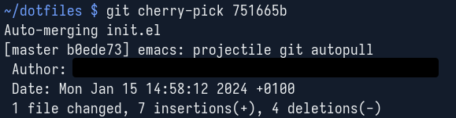
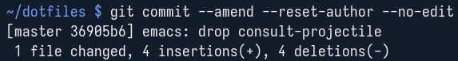
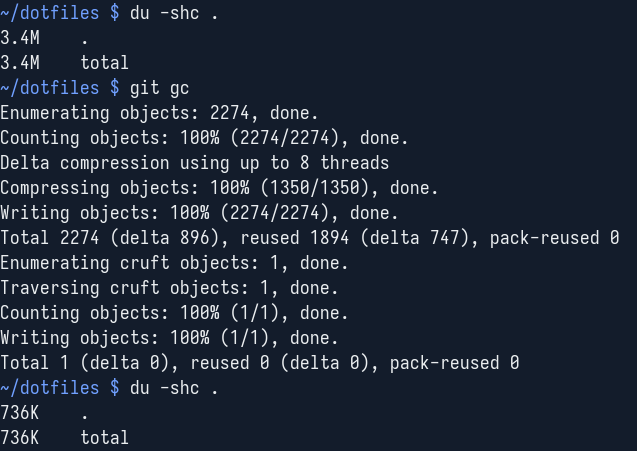

+++
title = "💻 Recovering Rebased Git Commits"
date = 2024-01-16
description = "Almost doxxed myself"
+++

Yesterday I accidentally committed to my public [dotfiles repository](https://github.com/port19x/dotfiles) with my work email, temporarily exposing both my full government name as well as my employer.
I rebased those commits away as fast as I could, temporarily loosing the changes of those two commits in the process.

It's not implausible that I need to recover git commits again in the future,
so I thought I'd share how I got my changes back and how you can get yours back do too, no matter how you lost yours.

tl;dr: [`git reflog`](https://git-scm.com/docs/git-reflog)
→ [`git cherry-pick`](https://git-scm.com/docs/git-cherry-pick)
→ [`git commit --amend`](https://git-scm.com/docs/git-commit)
→ [`(git gc)`](https://git-scm.com/docs/git-gc)

## Step 1 - Git Reflog

Step one is to run a `git reflog` to see if you still have the now orphaned commits lying around locally.
If the orphaned commits are not there, you can check a different machine or your file backups.
Without the reflog there is little chance of you recovering your changes.
You'll need the commit hashes of the commits you want to recover, so either keep the respective terminal open or write them down somewhere.

## Step 2 - Git Cherry-pick

Step two has you cherry picking the sequentially oldest commit you want to recover.

## Step 3 - Git Commit --amend

Now in step three I amended the cherry-picked commit to update the author field to the appropriate contents.
You can also edit the commit message if necessary, if not `--no-edit` suppresses the editor.
Now repeat step two and three with the next newer commit to recover until you're done.

## Step 4 - Git GC (optional)

After a while of locally working on a git repository the reflog can become quite large and orphans can accumulate.
After recovery is an appropriate time to do a git gc.
But be careful, those orphans are the key to recovery, so only gc once you're confident the recovery was successful.

See the following stack overflow exchange on [if and when to run git gc](https://stackoverflow.com/questions/55729/how-often-should-you-use-git-gc)
