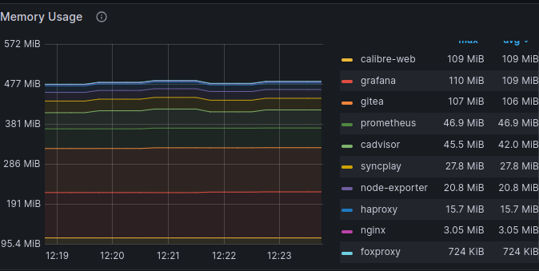

+++
title = "💻 Monitoring with Github Actions"
date = 2024-06-21
description = "-"
+++

## Why

A little while ago I wrote rapture, a modern server setup, with the goal of covering a wide range of popular infrastructure tooling.
It used what I call the [DANG Stack](https://port19.xyz/tech/dang-stack/), and birthed the two technical deep dives: \
on [Persisting Grafana](https://port19.xyz/tech/persisting-grafana/) and [DigitalOcean Provisioning with Ansible](https://port19.xyz/tech/ansible-provision/). \
While these fancy tools have their place in professional use, the high memory consumtion of Prometheus and Grafana, as well as the overhead of docker made me put the project on hold and set me on the lookout for more integrated, actually lightweight, alternatives.

<figure>

<figcaption><i>
They ate my ram
</i></figcaption>
</figure>

## How

I like to make frequent and thorough use of advanced github features, especially github actions.
So I got to work to implement monitoring of basic server vitals via github actions.

Scheduling actions is pretty easy and uses the familiar cron syntax.

```
on:
 schedule:
   - cron: "15 * * * *"
```

For ssh without a third-party action I came across [this](https://blog.benoitblanchon.fr/github-action-run-ssh-commands/) informative post.

```
- name: Configure SSH
  run: |
    mkdir -p ~/.ssh/
    echo "$SSH_KEY" > ~/.ssh/ssh.key
    chmod 600 ~/.ssh/ssh.key
    cat >>~/.ssh/config <<END
    Host monitoring
      HostName ansible.how
      User root
      IdentityFile ~/.ssh/ssh.key
      StrictHostKeyChecking no
    END
  env:
    SSH_KEY: ${{ secrets.SSH_KEY }}
```

Using this ssh access I managed to generate my desired csv line per poll.

```
- name: generate csv line
   run: |
     echo $(date +%H:%M-%D),\
          $(ssh monitoring free -m | grep -ow [0-9.]* | head -n 2 | tail -n 1),\
          $(ssh monitoring df -m / | grep -ow [0-9]* | head -n 2 | tail -n 1),\
          $(ssh monitoring uptime | cut -d ":" -f 5)\
     | tr -d " " >> stats.csv
```

Which then got appended to the already present csv and committed as an update.

```
- name: auwuto commit uwu
  uses: stefanzweifel/git-auto-commit-action@v5
  with:
    commit_message: bump stats.csv
    repository: .
    file_pattern: stats.csv
  env:
    GITHUB_TOKEN: ${{ secrets.GITHUB_TOKEN }}
```

## Results

github actions are clearly not meant to adhere to the specified cron timing with most of my action runs being delayed for around 5 minutes. The most impressive delay way at 1am yesterday, where my run got delayed for a whole 23 minutes.

I could have gone the extra mile and written a matplotlib visualisation of the stats, but chose not to.
Plotting a csv with python is much less interesting and has been documented to death already.

All the code and the csv for this proof of concept are [here](https://github.com/port19x/github-actions-monitoring)
