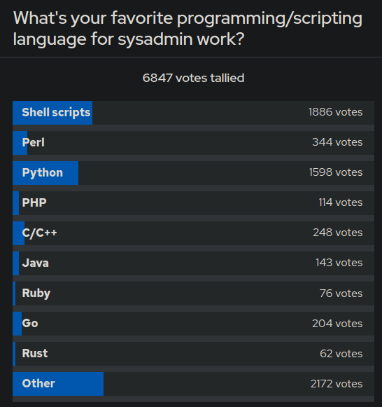

+++
title = "💻 Go Language Review"
date = 2023-09-10
description = "So I'm dropping Go to focus on Shell and Python"
+++

## Go isn't important

In my continued research on admin languages I spotted an article by RedHat from three years ago.
[That article](https://www.redhat.com/sysadmin/programming-languages-sysadmin) features a poll asking for the respondents favorite programming language for admin tasks.
By far the two most popular were Python and Shell, with C, Go and Perl forming a distant cluster of thirds.



The [devops roadmap](https://roadmap.sh/devops?r=devops-beginner) from roadmap.sh, while also recommending Go, just states to pick any programming language.
The purpose of the language is to be able to write automation scripts to automate repetitive tasks.
Devops, for those out of the loop is basically *admin done right* or sysadmin 2.

So at that point I already reclassified Go from a potential cornerstone of my tech stack to a firm third place, relegated only to internal CLI tools.

## Go isn't fun

I gave Go a shot yesterday. I tried to implement a TUI for the classic [mastermind](https://en.wikipedia.org/wiki/Mastermind_(board_game)) game.
Along the way I got reminded why I initially discarded the language when I spent a week doing coding puzzles with it about a year ago:
**Working with composite data structures in Go sucks**.
This is primarily regarding slices, but my very short time trying to leverage maps and then resorting to a switch case statement was no highlight either.
Slices are variable sized arrays. Go calls slices what would be lists in python or java.

Say you want to save a sorted copy of your slice. I python you just do `b = sorted(a)`. Let's see what we need to do in Go and how we need to adapt the semantics.
Well, let's figure out how to copy an array first, because `b := a` does not work and instead links to the same memory as a. \
Instead you have to do a `b := make([]int, len(a))` before doing a `copy(b, a)`. \
Now you may import the sort package from the standard library. \
Perhaps the idea arises to to `b := sortInts(b)`, which then complains because of course a sort function doesn't return a sorted slice.
No, instead it goes in and mutates the slice to be sorted directly.

Now, retrieving a sorted copy of a slice is surely an obscure operation that warrants a verbose workaround (it isn't), but how about deleting an element from a slice?
Surely, something so trivial has it's own easy to use function, right?
Python has several functions for this: `pop` removes the element at index and returns it, `del` just removes the element at index, and `remove` will traverse the list and remove the first element equal to the argument.
In Go, you need to do re-slicing. You can implement a function for removal like this:
```
func remove(slice []int, s int) []int {
    return append(slice[:s], slice[s+1:]...)
}
```
That this isn't a standard feature is really stupid, so at some point Go agreed and since 1.21 ships with a slices package in the standard library.
When you import that package you finally get access to stuff like `Delete`, `Contains`, `Reverse`, `Min`, `Max`, etc.
A small subset of list functions available in python, which is again a small subset of list functions available in any respectable functional language (e.g. Haskell, Clojure).

Go 1.21 released 5 weeks ago!
Until 5 weeks ago people were writing for loops and performed re-slicing for the most basic of list operations.
That's just not my cup of tea. If I have to write for loops to get basic functionality, have functions that mutate instead of returning, when I have a stupid gopath system to go on top of it, I'm out.

And, just to mention it, TUI libraries are as plentiful as in every other language, with no clear standard. \
CLI is clearly just Cobra and Viper, and that's neat, but tbh CLIs are easy to write in any language I know.

## Other languages of interest

This leaves a gap in the stack for a natively compiled language. \
This gap will remain open for some time, but I do know a few languages that may be of interest. \
Julia and Racket both have nothing to do with admin work, but are languages I find beautiful. \

[Racket](https://racket-lang.org/) is a dialect of Lisp, so it's in my back pocket for when I miss functional programming. \
[Julia](https://julialang.org/) is more of a fallback for if I dislike the data analytics and visualization workflow in python.

## Go ... maybe later

It isn't entirely unrealistic that I'll learn some Go sometime in the future.
It is very likely that I may have to make slight adjustments to someone elses "scripts" written in Perl or Go.
But at that point I'd rather learn on demand.
It's not like programming languages are the only tools counting towards admin skill.
