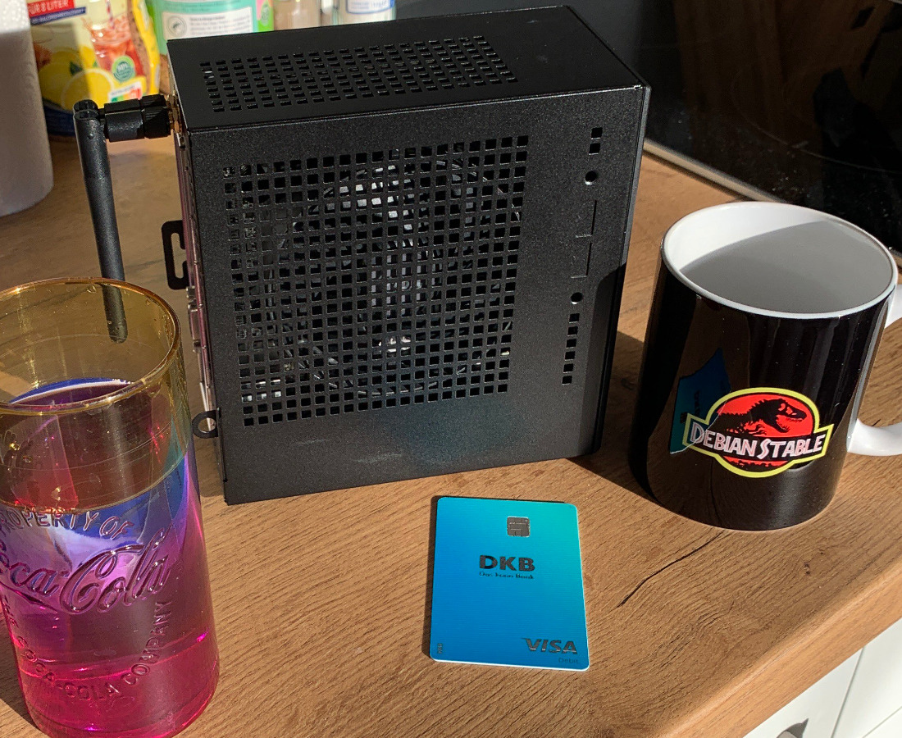

+++
title = "💻 New PC Build"
date = 2024-02-06
description = "The SSD was half the budget"
+++

<figure>

<figcaption><i>
The freshly built PC - various things for scale
</i></figcaption>
</figure>

So last weekend I built myself a fresh PC at a friends house.
I went with the Asrock DeskMini because I can mount it to the back of my monitor and, since I'm not that much of a gamer anyway, the inability to add a GPU doesn't bother me.
The DeskMini combines a case, motherboard and power supply in one tiny, two liter package. \
One thing that was important to me was to have lots of storage, as I've been fighting storage limitations on the 500GB SSD in my laptop over the past few months.
There is an argument to be made that 4TB is overkill, but I'd rather have too much than too little space for my precious pirate treasures. \
One problem is that the CPU cooler makes direct contact with the case mesh, thus transmitting the fan vibrations.
With a custom fan curve the noise is manageable.
At least the CPU gets fresh air, with the CPU usually being ~15°C Δt over ambient at idle and ~20-25°C Δt during my normal usage. \
I hope to amortise most of the build cost by selling my laptop after the upcoming last theory semester in college.
All in all, I'm satisfied with my purchase.

### Parts List

| Part (with links to geizhals.de)                                                                                      | rounded price |
|-----------------------------------------------------------------------------------------------------------------------|---------------|
| [Samsung 990 Pro 4TB SSD](https://geizhals.de/samsung-ssd-990-pro-4tb-mz-v9p4t0bw-a2798124.html)                      | 335€          |
| [AMD Ryzen 5 5600G](https://geizhals.de/amd-ryzen-5-5600g-100-100000252box-a2536507.html)                             | 110€          |
| [2x8GB G.Skill SO-DIMM 3200MHz](https://geizhals.de/g-skill-ripjaws-so-dimm-kit-16gb-f4-3200c22d-16grs-a2349370.html) | 35€           |
| [Asrock DeskMini X300](https://geizhals.de/asrock-deskmini-x300-a2345964.html)                                        | 155€          |
| [Asrock DeskMini Wifi Kit](https://geizhals.de/asrock-deskmini-wifi-kit-5rb000010010-a1531843.html)                   | 15€           |
| [Asrock DeskMini Vesa Mount Kit](https://geizhals.de/asrock-deskmini-vesa-mount-kit-5rb000010030-a1530360.html)       | 5€            |
| *Shipping*                                                                                                            | *10€*         |
| **Total**                                                                                                             | **665€**      |
