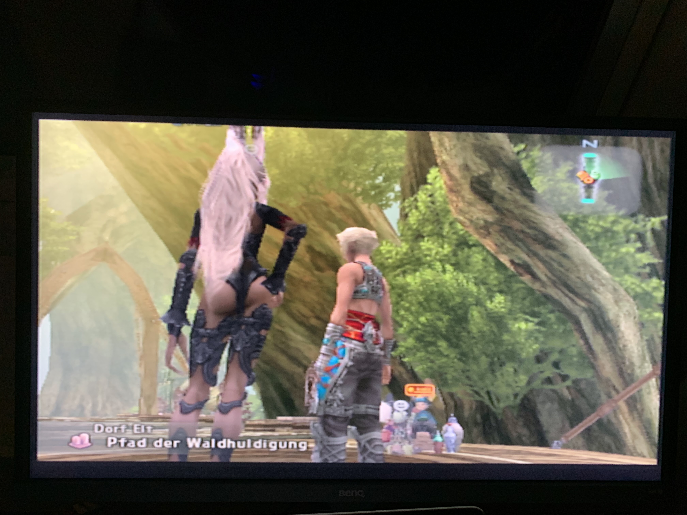

+++
title = "💻 Review of my Playstation 2 and 3"
date = 2024-09-24
description = "To emulate or not to emulate"
+++

*tl;dr ps2 is too pixelly and better emulated or played via ps3 re-releases*

<figure>

<figcaption><i>
PS2 - Final Fantasy 12 - 4k VA
</i></figcaption>
</figure>

## The Glorious Used Market

I'd like to open this review of my gaming consoles by expressing the great gratitude I have for the well priced used tech market in Germany.
Playstations from all generations grow on trees, if local ebay offers are any indication, and so do their games.
A PS2 slim + Card + Controller + 1-2 games can be had for under 100 Euros, and a PS3 slim + Controller + 1-2 games won't exceed it by much.
At the same time "Gaming PCs" that are capable of upscaled PS2 emulation are available under 200 Euros, with deals under 100 being possible if you make the right compromises.

For both the PS2 and the PS3, the slim versions have a reputation of higher reliability at less power consumption and noise.

## PS2 Hardware

The PS2 wired controller is almost identical to the PS3 wireless controller in terms of shape and feel, with the notable exception being the analog face buttons.
It was a surprise when I tried to play Gran Turismo 3 A-Spec and couldn't reliably accelerate without rebinding acceleration to one of the analog sticks.

The console itself, the PS2 slim anyway, is very quiet with only the optical drive making annoying noises occasionally.
It is small, light and certainly power efficient.

What sucks is that you need a PS2 memory card and either an old-ish TV that supports a composite signal or a converter.
These costs can make the PS2 more expensive than a PS3, and having that one more power cable, that one more converter laying around does clutter my desk.

## PS2 Games and Graphics

The Playstation 2 has some great games, see the top list I link to on my [retro-games page](https://port19.xyz/retro-games/).
The graphics are bearable, which is not something I can say for the original Playstation, but they are definitely dated.
I can definitely make out individual pixels on that 480p resolution, and even a nice 4k screen can only go so far in enhancing the image quality.

Most good Playstation 2 games have been re-released as HD Remasters or as part of a collection on the PS3.

## PS3 Hardware

The PS3 slim is sadly not a rectangle, and neither is the super slim, so you can't stack it.
It does get loud, but doesn't become a PS4 level jet engine.
Youtube has decent comparisons for noise.

The controller is comfy I guess.

I swapped the cheap old HDD in my PS3 slim for a used Samsung 850 Evo SSD, which noticeably improves boot times as well as load times in games like Rage.
I believe it also marginally improves noise and power consumption.

HDMI is weird to note as a perk, but once you went through adapter-hell with the PS2, you learn to appreciate it.

## PS3 Games and Graphics

The graphics are at the perfect level for my tastes.
Good, but with no watts being wasted to ray trace the exact reflections in a mud pit.
The 1080p resolution helps a lot here.

PS3 has nice remasters from the PS2 era as well as plenty of originals of its own.
I'd say it's the last generation before the gaming industry got extremely uncreative.
PS3 is already less radical in terms of game designs than the PS2 and it is more of a generation of refinements and small improvements.

## Emulation

If you have a reasonably recent PC, you can emulate PS2.
If you have a dedicated GPU or Ryzen APU, you can heavily upscale PS2.
PS2 emulation works with few flaws and I highly recommend it over original hardware after having tried both.

PS3 definitely requires some tinkering to emulate and upscaling is less unnecessary and a lot more costly.
You would need an impressive midrange gaming PC, like Ryzen-something plus 300+ USD GPU, to upscale PS3.
And even then a large minority (like 30%) of PS3 games don't work yet.
Also ROMs begin to seriously eat away at your storage in this territory.

## My Advice

To the time travelling me of 4 months ago:
- don't buy a PS2
- emulate upscaled PS2 ROMs over buying their PS3 remasters
- buying a PS3 Slim is worth it
- SSD swapping a PS3 is worth it [(Tutorial)](https://www.youtube.com/watch?v=DnGOftkdAM0)
- No (physical) game hoarding, only buy a new game when you finish or completely quit an old one

## How I plan to proceed

I plan to sell my PS2, although being 20 hours / one third into final fantasy 12 with no convenient way to transfer the save file will delay that sale a little.
I may or may not sell my PS3, depending on how much use it sees over the coming months.
Some PS3 Remasters will be sold (or traded) and instead played via emulation. Final Fantasy 10 and Kingdom Hearts come to mind.
I will buy a used midrange tower PC, like 200 bucks, and put [Batocera Linux](https://batocera.org/) on it to use it as a general Media PC.

Check [retro-games page](https://port19.xyz/retro-games/) from time to time for updates.
