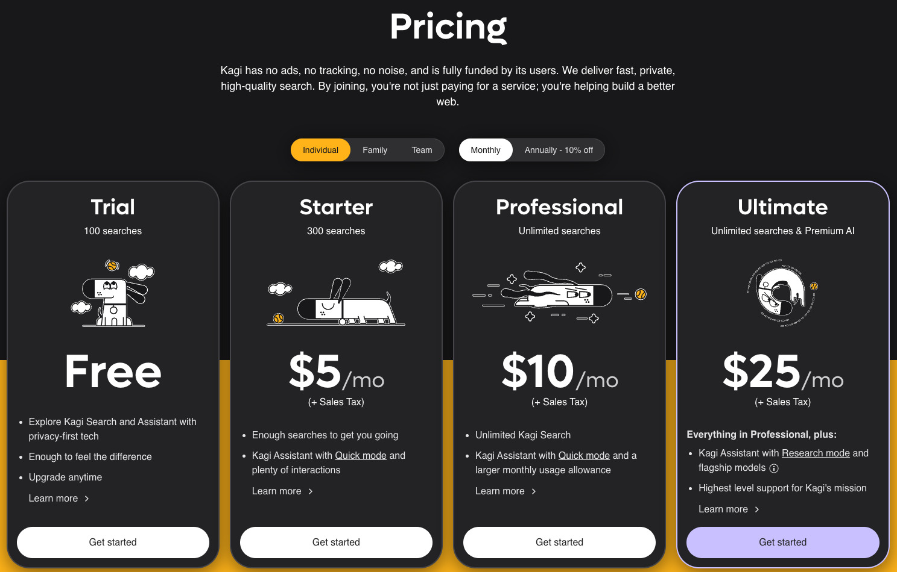
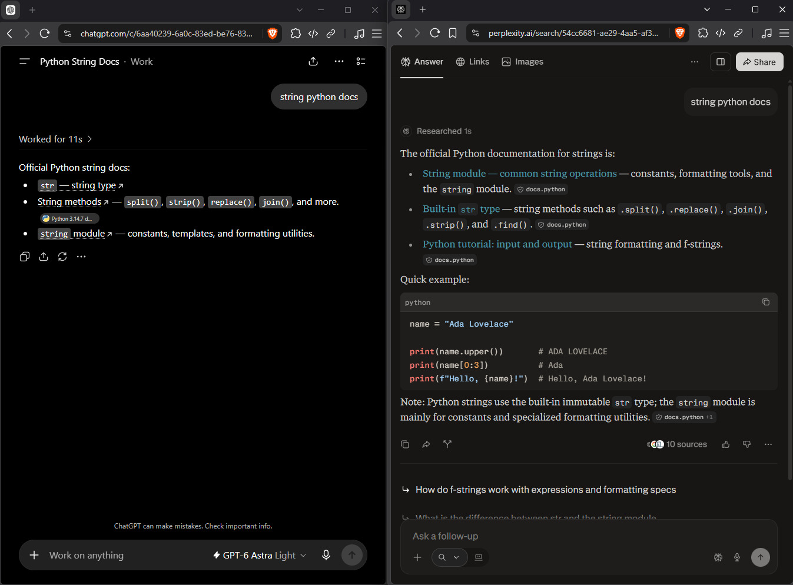

+++
title = "💻 Review of Current Search"
date = 2026-09-11
description = "oneshotted dictated unedited prose, next post will be juicy"
+++

*oneshotted dictated unedited prose, next post will be juicy*

<audio controls>
  <source src="narrated.mp3" type="audio/mpeg">
Your browser does not support the audio element.
</audio>

It is no secret to anyone that search has been pretty bad for a number of years now.
This has led to the creation of several alternative search engines and the emergence of new strategies to find valuable content online.
In this post, I want to line out what I use for search and what I can recommend.

On the whole, it seems to be wise to pick such search engines that have their own index.
My recommendations would be [Brave Search](https://search.brave.com/) for general web search and [Yandex](https://yandex.com/images/) specifically for images.

If you are open to a paid model, there are two products worth looking at.
Both with a free tier, so you can try the basic premise before committing.
In terms of a traditional search engine, we have [Kagi](https://kagi.com/), which I have not tried yet, but keep hearing good things about.
It also has its own index and a paid model where you pay per search and have plans.
I believe the basic premium plan is 10 bucks for 500 searches.

<figure>

<figcaption><i>
Not quite. It's cheaper than that.
</i></figcaption>
</figure>

The one product I've actually used is [Perplexity](https://www.perplexity.ai/).
And Perplexity is an AI company that pioneered search in AI very early, but still delivers us far better link quality and accuracy than even the frontier models by OpenAI and Anthropic.
I used it extensively in July with the following prompt:

```
Under each response, draw a horizontal line.
Below, include 3 Links you deem especially useful to my request,
plus one authoritative source (e.g. scientific studies, government agencies or official documentation),
plus one social thread (usually reddit).
Do not invent links.
These links need to be clickable.
```

Now for some things I recommend against.
I do not think Zerx is a good product.
I also believe that Google wrappers like Startpage or DuckDuckGo for Bing are worth any attention at all.
Also, if you do want links, then other AI providers to me are currently still insufficient, unless you know precisely what you want already.
If I ask chat GPT to give me the documentation for Swift arrays, it will provide me with a correct link to the documentation.
However, if I ask it what the prevailing opinion on calf raises is in the bodyweight exercise community, it might put out some pretty underwhelming links, even using the prompt outlined earlier.

<figure>

<figcaption><i>
See for yourself
</i></figcaption>
</figure>

All in all, search is needlessly difficult, but with the tools outlined in this article, I'm sure you can find ways to make it work for you.
I hope this was helpful and I'm curious if you have any suggestions for better search that I should try. Thank you.
