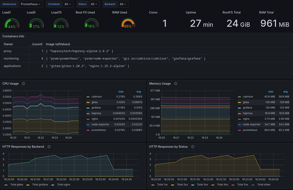
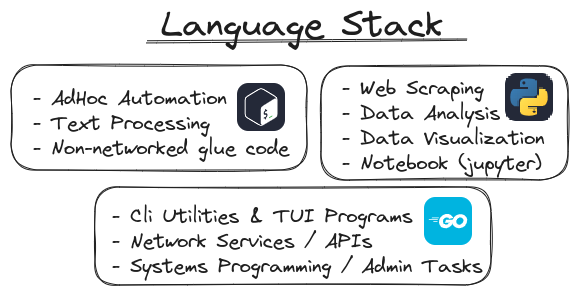

+++
title = "💻 Status Update and Q4 Goals"
date = 2023-08-30
description = "(Pr|R)eview"
+++

## It's been a while

So my last post talking about what I'm doing and where I'm headed has been a while. \
I hinted at my server tech stack back in July in my post on the [Dang Stack](https://port19.xyz/tech/dang-stack/),
but the last time I actually talked about what I'm learning and future plans was in February with my post [Clojure: 6 months later](https://port19.xyz/tech/clojure/). \
Time for another update!

## Server Status

As foreshadowed in February I dove head-first into modern infrastructure development.
I picked up a good bit of Ansible and spent time with Prometheus and Grafana.
I also host a copy of this website on Nginx, and a Gitea instance.
My involvement in docker has been as much by desire as by necessity, as I'm currently putting the finishing touches on a ~50 page paper on Kubernetes network monitoring. So it comes at no surprise that it is the fundamental runtime I host everything on. *(Docker not K8s)* \
One notable deviation from the "DANG Stack" I initially revealed in July is my move to HAProxy as the load balancer.
It is a lot nicer to configure and interfaces more seamlessly with my monitoring stack.
It is also a major component in the tech stack of my next department at work, where I'll spend my third year.

The server can be explored here.¹ \
Note the `git` and `status` subdomains for Gitea and Grafana respectively. \
The infrastructure code is hosted on github in [this repository](https://github.com/port19x/rapture).

¹the site is no longer hosted

## Coding Status

It actually took me until mid June to really let go of Clojure as my primary programming language of choice. I archived all nine projects I wrote in my time with the language under a [single github repo](https://github.com/port19x/clojure-era). The archival was done in a way that keeps the git history intact: [git bundles](https://www.git-scm.com/docs/git-bundle)
Since then my programming has mostly been in posix shell again, with many small PRs as well as a proof of concept dockerized API [(foxproxy)](https://github.com/port19x/foxproxy).

## Server Goals

I would like to expand on the software I host on my server. In particular I'd like to host:
- Calibre Web (ebook library)
- Jitsi (video calls)
- Syncplay Instance
- A public Arch Linux Mirror

This list will likely grow as I discover more cool software that would benefit me or my friends.

I also want to modularize my current Ansible setup via the use of roles and prepare it for a multi-server setup.
This entails the need to port some currently static config files to jinja templates.
This is motivated by the cost efficiency of horizontal scaling on digital ocean.

## Coding Goals

I'd like to code (yet another) Nginx log exporter for Prometheus, but with a stated focus on analytics.
The current ones are more focused on health stats of Nginx, like quantile latencies and status codes.
My exporter will focus on metrics of the requested paths and thus be a viable way to get server side page analytics.
At that point I have enough reason to migrate this website from github pages to my own server.
If you're worried about privacy intrusion because I'll see you in my access log, keep in mind that currently it's just logged out of my reach at microsoft. I hope I'm more trustworthy with benign data than microsoft. Besides, I'm only interested in page hits anyway.

Another thing I'd like to develop is a docker image for arch linux mirrors, with the express goal of it becoming an officially endorsed standard.

In terms of languages I'd like to hone in on a focused set of admin languages: shell, go, python.
Within these I'll make sure to analyze their strengths and assign particular use-cases to the best respective programming language.
See my preliminary use-case analysis from about a week ago:

While I have extensive experience in python and shell already, go is something new. Its robust error handling, concurrency, pointers and static typing are foreign to me. I do of course have a rough understanding of the concepts, but I have never extensively used a language with said features.

## General Outlook

Q4 is also the start of the 5th semester of my CS degree, so if push comes to shove I'll have to prioritize my formal education over these fun side projects.
I'll try my best to at least stick to the somewhat frequent posts on this blog and keep you guys updated.
