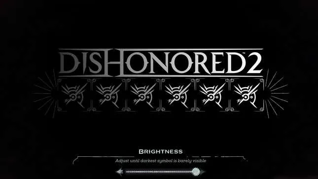

+++
title = "💻 Why I prefer VA Monitors"
date = 2023-08-25
description = "I love some good contrast"
+++

Ever noticed how some video games have a brightness slider? Such video games often have rich visuals and a dark atmosphere that would clash with an extremely bright image. You want that slider to be as dark as possible without losing visibility.

VA Monitors and their 3000:1 static contrast ratio are the solution. \
IPS Monitors only manage to get 1000:1 in static contrast.

Back when I owned a 1080p VA Monitor [(BENQ GW2470HM)](https://geizhals.de/benq-gw2470hm-9h-leyla-tbe-a1498511.html), some games looked better than even on the 4k IPS Monitor that eventually replaced it.
Such games include Control, the whole Tomb Raider series, Bioshock, Dishonored and even some 2D games like enter the gungeon.
Ghosting isn't an issue at 60hz unless you have a really bad VA monitor.

If I had to buy a new monitor today, I'd go with the [BENQ3270U](https://geizhals.de/benq-ew3270u-9h-lgvla-tse-a1790472.html). \
4k VA 32" and speakers, just how I like it.

I also played with the idea of a 1440p ultrawide, the [Samsung SJ550](https://geizhals.de/samsung-s34j550wqr-s34j552wqr-ls34j550wqrxen-ls34j552wqrxen-a2498760.html) being a good candidate at the time. Nowadays, that monitor seems to have been replaced by the [Samsung ViewFinity S5 S50GC](https://geizhals.de/samsung-viewfinity-s5-s50gc-ls34c500gauxen-a2952787.html).
1440p ultrawide would be attractive for the option of using a 3 column window manager layout, tho that seems to be a hassle to set up in awesomewm. I'd probably hop window managers to something like xmonad if I ever went with a 1440p ultrawide.

