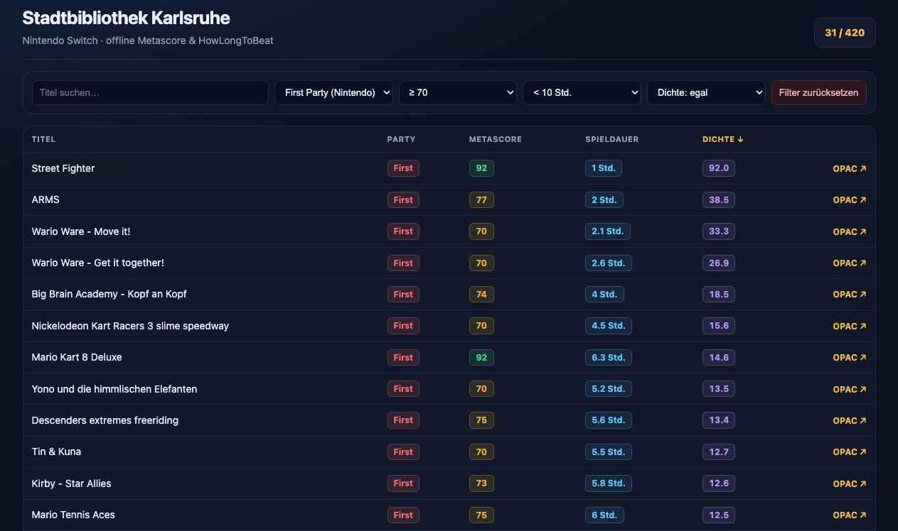

+++
title = "💻 My first experience with vibe coding"
date = 2026-08-14
description = "Making a database for the Nintendo Switch games of my local library"
+++

So, around a month ago, I had my first real experience with vibe coding.
I define vibe coding as generating the whole application with minimal or no human editing of the source code.
In this post, I want to share my experience.

## Application

I have a Nintendo Switch 2 and my [local library](https://stadtbibliothek.karlsruhe.de/) has a large catalogue of ca 500 Nintendo Switch games that are accessible via a [RSS file](https://opac.karlsruhe.de/cgi-bin/koha/opac-search.pl?&limit=mc-itype%2Cphr%3A17&limit=ccode%3A7507&count=1000&sort_by=acqdate_dsc&format=rss).

Before playing a game, I like to look it up on [Metacritic](https://www.metacritic.com/) as well as [Howlongtobeat](https://howlongtobeat.com/) as I like short games that are at least decent.

The goal of the website is to have a pregenerated static JSON database as well as a small self-contained web frontend that I can both host on GitHub pages.
The user interface should resemble a table with titles, first or third-party distinction, Metacritic score, Howlongtobeat playtime (main+extra), a density score, and a link to my local library index.
It should have filters and be sortable by column.

## Why?

Technologically, this should play to the strengths of current AI, as simple data aggregation and manipulation, as well as basic front-end design are well within their capabilities.
At the same time, it checks for self-correction, data normalization, and thorough scraping abilities, since this aggregates the data of 3 websites into one data set.

The version that you can use and see right now was made in the browser with [arena.ai](https://arena.ai) in eight iterations, taking about 1.5 hours total, plus another manual half hour for deployment onto GitHub pages.
Taking the Application paragraph as a prompt, this could be a good benchmark for frontier harnesses, such as
[Claude Code](https://claude.com/product/claude-code),
[Codex](https://openai.com/codex/),
[Grok build](https://x.ai/build),
or [Gemini CLI](https://geminicli.com/).

What took eight iterations and 1.5 hours in [arena.ai](https://arena.ai) should realistically be one-shotable by the current frontier.
Look for updates to [the repo](https://github.com/port19x/nintendo-switch-library) on different branches, as well as edits to the readme on the master branch to follow future benchmarking with this.

## Perspective

Around two years ago, I first used AI to assist in a coding project, namely [deadsniper](https://github.com/port19x/deadsniper) where GPT4o was helpful,
but still incapable of doing more than giving short snippets for idioms in go that I at the time was unfamiliar with.

Now you can feasibly develop small applications entirely with AI and the scope of what is possible is growing month by month.
Depending on how much you are willing to spend, you're already able to do some amazing things with modern AI harnesses.
Take this demo as a floor of current capability and not as the ceiling.

*While this post is about AI, it was entirely written and edited by me. The only tool that’s technically AI that was involved in the process is MacOS 27 dictation. AI as a field is developing at an incredible pace, so if this post is more than a year old treat it as a historical artifact.*
