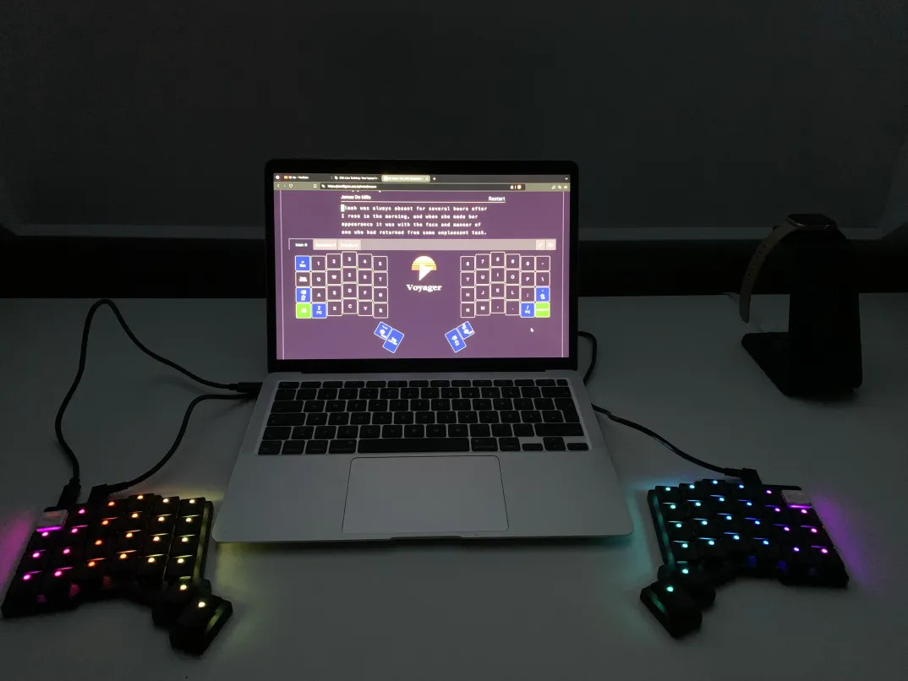

+++
title = "💻 ZSA Voyager Review"
date = 2024-09-25
description = "Way too expensive keyboard"
+++

<figure>

<figcaption><i>
ZSA Voyager next to M1 Macbook Air - Oryx Training
</i></figcaption>
</figure>

### Price Breakdown

- [ZSA Voyager](https://www.zsa.io/voyager): ~330€ (365 USD)
- VAT & Imprort Duties: 77€
- [Ambient Nocturnal Switches](https://keycapsss.com/switchestester/switches/272/ambients-silent-choc-switches-lowprokb-kailh-choc-v1?number=KC10221_NOC) & [Bongo Cat Keycaps](https://keycapsss.com/artisan-keycaps/226/bongo-cat-novelty-keycap-oem/dsa/low-profile-choc?number=KC10117.4&c=5): 70€

Sum: ~480€

## Light Silent Linear Switches

The Ambient Nocturnal Switches I ordered for this keyboard are choc style key switches, which is an emerging standard for low profile keyboards.
They are silent linears, perfect for an office environment, and actually make the keyobard much quieter than even regular office keyboards.
The 20g bottom out weight is only a third of the usual switch weight you encounter in the cherry mx brown for example, but also in the aliaz 60g I used in my previous keyboard.

Since the switches are so drastically different from anything else I have previously used it was actually easy to adapt.
I believe switching to a cherry mx red would have been more difficult, since it would have been similar enough that the small differences would annoy me.
I highly recommend these switches, especially over the 35g version. Go all the way.

One thing to note: resting my full finger weight on these actuates them, which is jarring at first but promotes ergonomic hover typing.

## Column Stagger

This took a bit of getting used to and some retraining of how I hit "c".
Ultimately I think that ortholinear, that is having the keys in a grid, does help ergonomics.
I am not sold that column stagger meaningfully enhances ergonomics further, but ultimately feel indifferent towards it.

## Split Keyboard

I will say that in the first few days, including when that picture was taken, I overdid it with the distance between my keyboard halves.
This misuse of my ergonomic keyboard ironically gave me some slight wrist pain before I adjusted it.
Now there is a little more than a hands width between the keyboard halves.
It is nice for ergonomics, but since my RSI has always been localized more to the fingers I benefit less from this than someone with wrist pain.

## Quality and Portability

The Keyboard arrived with lots of little accessories and in a nice packaging.
The board is made of some kind of metal from what I can tell, but still remains light due to its small size.
The tenting magnets are a nice touch, but I don't use them myself.

On the software side, [oryx](https://www.zsa.io/oryx) is awesome.
It makes custom keyboard configuration that much more accessible.
I have not made full use of this yet, as I wanted to adapt to the new keyboard shape and switches first before even considering a change in keyboard layout.
What I do use currently is the tap/hold overloading of keys, to great effect.
I will say that as I have gotten more proficient at typing on this keyboard I have continued to lower the hold threshold from the default 175 to 125, and then recently to 100 milliseconds.

The included carrying case seems to be of decent quality and I use it every day to carry my keyboard from home to work and back.

## Pipe Problems

If there is one major thing I'm going to complain about it's the pipe key and the crocodiles: <|>

I use a german keyboard layout in my OS, with the voyager actually needing an american layout in the OS for all the keys in the online configurator to correspond to the actual keys arriving in your text buffer.
Since (american) ANSI keyboards have one key less than the (european) ISO keyboards do, there is actually no key that corresponds to where <|> are on a german layout.
I searched the web for like half an hour before giving up on the matter and instead binding keys in emacs for this purpose.

## Conclusion

This is a really expensive keyboard.
I do like it and believe it will pay for itself in the form of reduced RSI, increased work capacity or both.
However I don't recommend it to anyone who is not affected by ergonomic issues.
If you like expensive high quality peripherals it is also a justifiable purchase.

*If only there was a way to make the mouse more ergonomic as well.[¹](https://en.wikipedia.org/wiki/Foreshadowing)*